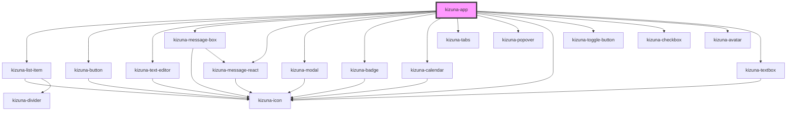

# kizuna-app

<!-- Auto Generated Below -->

## Dependencies

### Depends on

- [kizuna-list-item](../kizuna-list-item)
- [kizuna-button](../kizuna-button)
- [kizuna-text-editor](../kizuna-text-editor)
- [kizuna-message-box](../kizuna-message-box)
- [kizuna-message-react](../kizuna-message-react)
- [kizuna-modal](../kizuna-modal)
- [kizuna-badge](../kizuna-badge)
- [kizuna-calendar](../kizuna-calendar)
- [kizuna-tabs](../kizuna-tabs)
- [kizuna-popover](../kizuna-popover)
- [kizuna-icon](../kizuna-icon)
- [kizuna-toggle-button](../kizuna-toggle-button)
- [kizuna-checkbox](../kizuna-checkbox)
- [kizuna-avatar](../kizuna-avatar)
- [kizuna-textbox](../kizuna-textbox)

### Graph

----------------------------------------------

*Built with [StencilJS](https://stenciljs.com/)*
