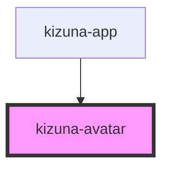

# kizuna-avatar

<!-- Auto Generated Below -->

## Properties

| Property    | Attribute   | Description | Type                      | Default     |
| ----------- | ----------- | ----------- | ------------------------- | ----------- |
| `classes`   | --          |             | `{ [key: string]: any; }` | `undefined` |
| `image`     | `image`     |             | `string`                  | `undefined` |
| `indicator` | `indicator` |             | `boolean`                 | `undefined` |
| `name`      | `name`      |             | `string`                  | `undefined` |
| `rounded`   | `rounded`   |             | `string`                  | `undefined` |
| `size`      | `size`      |             | `string`                  | `undefined` |
| `status`    | `status`    |             | `string`                  | `undefined` |

## Dependencies

### Used by

 - [kizuna-app](../App)

### Graph

----------------------------------------------

*Built with [StencilJS](https://stenciljs.com/)*
