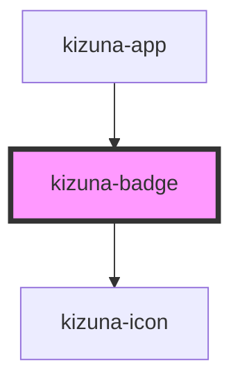

# kizuna-badge

<!-- Auto Generated Below -->

## Properties

| Property   | Attribute  | Description | Type                      | Default     |
| ---------- | ---------- | ----------- | ------------------------- | ----------- |
| `classes`  | --         |             | `{ [key: string]: any; }` | `undefined` |
| `darkmode` | `darkmode` |             | `boolean`                 | `undefined` |
| `icon`     | `icon`     |             | `string`                  | `undefined` |
| `text`     | `text`     |             | `string`                  | `undefined` |

## Dependencies

### Used by

 - [kizuna-app](../App)

### Depends on

- [kizuna-icon](../kizuna-icon)

### Graph

----------------------------------------------

*Built with [StencilJS](https://stenciljs.com/)*
