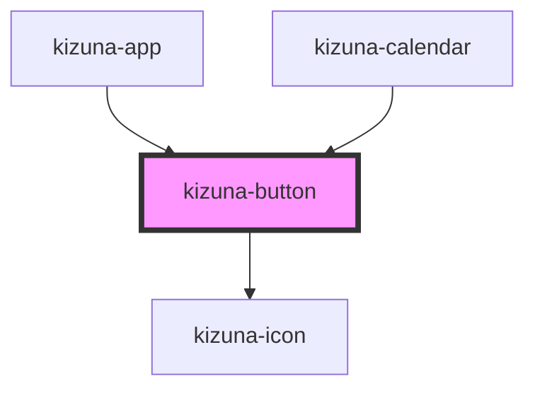

# kizuna-button

<!-- Auto Generated Below -->

## Properties

| Property        | Attribute  | Description | Type                      | Default     |
| --------------- | ---------- | ----------- | ------------------------- | ----------- |
| `classes`       | --         |             | `{ [key: string]: any; }` | `undefined` |
| `disabled`      | `disabled` |             | `boolean`                 | `undefined` |
| `handleOnClick` | --         |             | `Function`                | `undefined` |
| `icon`          | `icon`     |             | `string`                  | `undefined` |
| `rounded`       | `rounded`  |             | `boolean`                 | `undefined` |
| `text`          | `text`     |             | `string`                  | `undefined` |
| `type`          | `type`     |             | `string`                  | `undefined` |

## Dependencies

### Used by

 - [kizuna-app](../App)
 - [kizuna-calendar](../kizuna-calendar)

### Depends on

- [kizuna-icon](../kizuna-icon)

### Graph

----------------------------------------------

*Built with [StencilJS](https://stenciljs.com/)*
