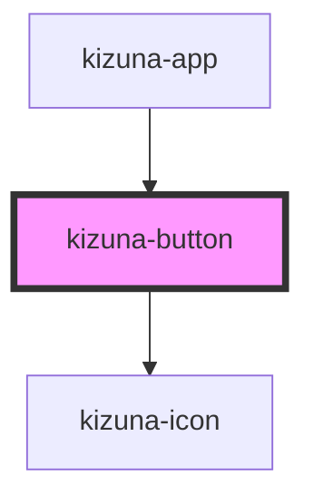

# kizuna-button

<!-- Auto Generated Below -->

## Properties

| Property            | Attribute             | Description | Type                      | Default     |
| ------------------- | --------------------- | ----------- | ------------------------- | ----------- |
| `classes`           | --                    |             | `{ [key: string]: any; }` | `undefined` |
| `disableClickEvent` | `disable-click-event` |             | `boolean`                 | `undefined` |
| `disabled`          | `disabled`            |             | `boolean`                 | `undefined` |
| `handleClick`       | --                    |             | `Function`                | `undefined` |
| `icon`              | `icon`                |             | `string`                  | `undefined` |
| `rounded`           | `rounded`             |             | `boolean`                 | `undefined` |
| `text`              | `text`                |             | `string`                  | `undefined` |
| `type`              | `type`                |             | `string`                  | `undefined` |

## Dependencies

### Used by

 - [kizuna-app](../App)

### Depends on

- [kizuna-icon](../kizuna-icon)

### Graph

----------------------------------------------

*Built with [StencilJS](https://stenciljs.com/)*
