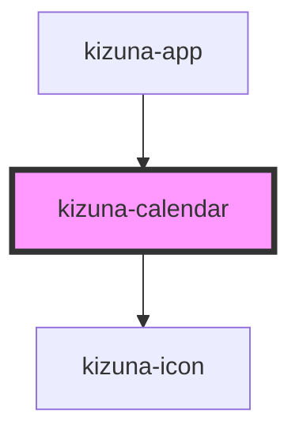

# kizuna-calendar

<!-- Auto Generated Below -->

## Properties

| Property     | Attribute  | Description | Type                      | Default                                                                                                                                                                           |
| ------------ | ---------- | ----------- | ------------------------- | --------------------------------------------------------------------------------------------------------------------------------------------------------------------------------- |
| `classes`    | --         |             | `{ [key: string]: any; }` | `undefined`                                                                                                                                                                       |
| `darkmode`   | `darkmode` |             | `boolean`                 | `false`                                                                                                                                                                           |
| `dayNames`   | --         |             | `string[]`                | `['M', 'T', 'W', 'Th', 'F', 'Sa', 'Su']`                                                                                                                                          |
| `id`         | `id`       |             | `string`                  | `uuidv4()`                                                                                                                                                                        |
| `monthNames` | --         |             | `string[]`                | `[     'January',     'February',     'March',     'April',     'May',     'June',     'July',     'August',     'September',     'October',     'November',     'December',   ]` |
| `position`   | `position` |             | `string`                  | `undefined`                                                                                                                                                                       |
| `value`      | `value`    |             | `string`                  | `undefined`                                                                                                                                                                       |

## Events

| Event          | Description | Type                         |
| -------------- | ----------- | ---------------------------- |
| `handleChange` |             | `CustomEvent<CalendarEntry>` |

## Dependencies

### Used by

 - [kizuna-app](../App)

### Depends on

- [kizuna-icon](../kizuna-icon)

### Graph

----------------------------------------------

*Built with [StencilJS](https://stenciljs.com/)*
