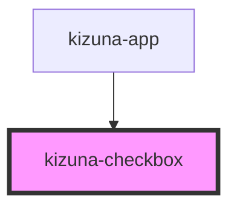

# kizuna-checkbox

<!-- Auto Generated Below -->

## Properties

| Property   | Attribute  | Description | Type                      | Default     |
| ---------- | ---------- | ----------- | ------------------------- | ----------- |
| `checked`  | `checked`  |             | `boolean`                 | `undefined` |
| `classes`  | --         |             | `{ [key: string]: any; }` | `undefined` |
| `disabled` | `disabled` |             | `boolean`                 | `undefined` |
| `name`     | `name`     |             | `string`                  | `undefined` |
| `rounded`  | `rounded`  |             | `boolean`                 | `undefined` |
| `value`    | `value`    |             | `string`                  | `undefined` |

## Dependencies

### Used by

 - [kizuna-app](../App)

### Graph

----------------------------------------------

*Built with [StencilJS](https://stenciljs.com/)*
