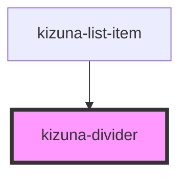

# kizuna-divider

<!-- Auto Generated Below -->

## Properties

| Property  | Attribute | Description | Type                      | Default     |
| --------- | --------- | ----------- | ------------------------- | ----------- |
| `classes` | --        |             | `{ [key: string]: any; }` | `undefined` |

## Dependencies

### Used by

 - [kizuna-list-item](../kizuna-list-item)

### Graph

----------------------------------------------

*Built with [StencilJS](https://stenciljs.com/)*
