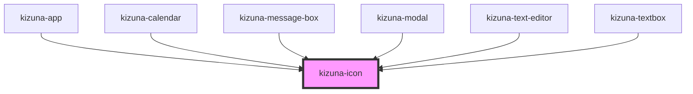

# kizuna-icon

<!-- Auto Generated Below -->

## Properties

| Property  | Attribute | Description | Type                      | Default     |
| --------- | --------- | ----------- | ------------------------- | ----------- |
| `classes` | --        |             | `{ [key: string]: any; }` | `undefined` |
| `name`    | `name`    |             | `string`                  | `''`        |
| `size`    | `size`    |             | `string`                  | `undefined` |

## Dependencies

### Used by

 - [kizuna-app](../App)
 - [kizuna-calendar](../kizuna-calendar)
 - [kizuna-message-box](../kizuna-message-box)
 - [kizuna-modal](../kizuna-modal)
 - [kizuna-text-editor](../kizuna-text-editor)
 - [kizuna-textbox](../kizuna-textbox)

### Graph

----------------------------------------------

*Built with [StencilJS](https://stenciljs.com/)*
