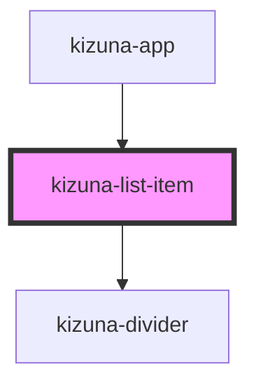

# kizuna-list-item

<!-- Auto Generated Below -->

## Properties

| Property        | Attribute  | Description | Type                      | Default            |
| --------------- | ---------- | ----------- | ------------------------- | ------------------ |
| `classes`       | --         |             | `{ [key: string]: any; }` | `undefined`        |
| `disabled`      | `disabled` |             | `boolean`                 | `undefined`        |
| `divider`       | `divider`  |             | `boolean`                 | `undefined`        |
| `handleOnClick` | --         |             | `Function`                | `undefined`        |
| `icon`          | --         |             | `Element`                 | `undefined`        |
| `text`          | `text`     |             | `string`                  | `'List Item Text'` |
| `type`          | `type`     |             | `string`                  | `undefined`        |

## Dependencies

### Used by

 - [kizuna-app](../App)

### Depends on

- [kizuna-divider](../kizuna-divider)

### Graph

----------------------------------------------

*Built with [StencilJS](https://stenciljs.com/)*
