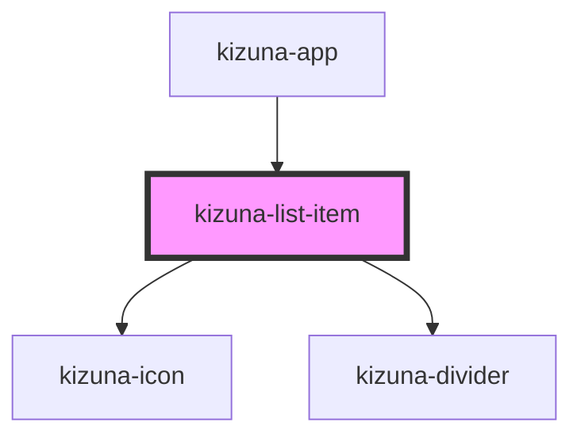

# kizuna-list-item

<!-- Auto Generated Below -->

## Properties

| Property  | Attribute | Description | Type                      | Default            |
| --------- | --------- | ----------- | ------------------------- | ------------------ |
| `classes` | --        |             | `{ [key: string]: any; }` | `undefined`        |
| `divider` | `divider` |             | `boolean`                 | `undefined`        |
| `icon`    | `icon`    |             | `string`                  | `undefined`        |
| `text`    | `text`    |             | `string`                  | `'List Item Text'` |
| `value`   | `value`   |             | `string`                  | `''`               |

## Events

| Event         | Description | Type                  |
| ------------- | ----------- | --------------------- |
| `handleClick` |             | `CustomEvent<string>` |

## Dependencies

### Used by

 - [kizuna-app](../App)

### Depends on

- [kizuna-icon](../kizuna-icon)
- [kizuna-divider](../kizuna-divider)

### Graph

----------------------------------------------

*Built with [StencilJS](https://stenciljs.com/)*
