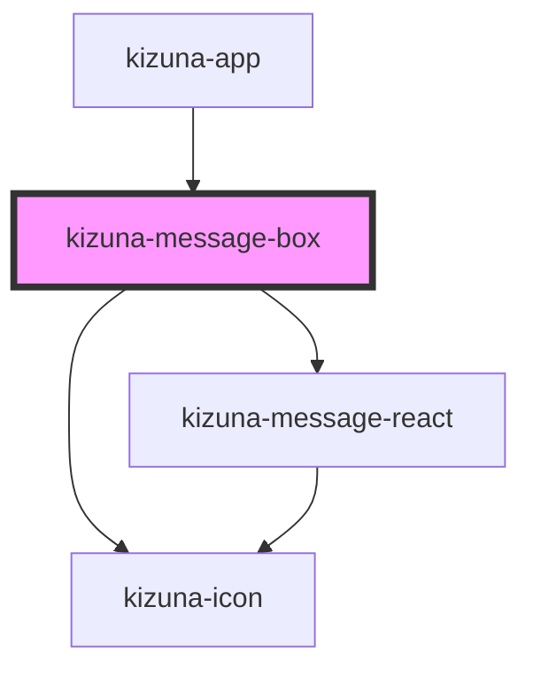

# kizuna-message-box

<!-- Auto Generated Below -->

## Properties

| Property        | Attribute        | Description | Type                        | Default     |
| --------------- | ---------------- | ----------- | --------------------------- | ----------- |
| `classes`       | --               |             | `{ [key: string]: any; }`   | `undefined` |
| `darkmode`      | `darkmode`       |             | `boolean`                   | `undefined` |
| `message`       | `message`        |             | `string`                    | `undefined` |
| `messageStatus` | `message-status` |             | `string`                    | `undefined` |
| `reactionList`  | --               |             | `{ [key: string]: any; }[]` | `undefined` |
| `sent`          | `sent`           |             | `boolean`                   | `undefined` |
| `time`          | `time`           |             | `string`                    | `undefined` |

## Dependencies

### Used by

 - [kizuna-app](../App)

### Depends on

- [kizuna-icon](../kizuna-icon)
- [kizuna-message-react](../kizuna-message-react)

### Graph

----------------------------------------------

*Built with [StencilJS](https://stenciljs.com/)*
