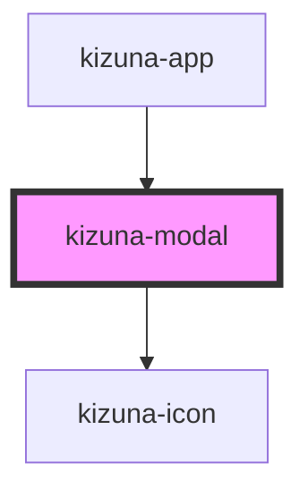

# kizuna-modal

<!-- Auto Generated Below -->

## Properties

| Property      | Attribute     | Description | Type                      | Default     |
| ------------- | ------------- | ----------- | ------------------------- | ----------- |
| `classes`     | --            |             | `{ [key: string]: any; }` | `undefined` |
| `closeIcon`   | --            |             | `Element`                 | `undefined` |
| `onClose`     | --            |             | `Function`                | `undefined` |
| `open`        | `open`        |             | `any`                     | `undefined` |
| `transparent` | `transparent` |             | `boolean`                 | `false`     |

## Dependencies

### Used by

 - [kizuna-app](../App)

### Depends on

- [kizuna-icon](../kizuna-icon)

### Graph

----------------------------------------------

*Built with [StencilJS](https://stenciljs.com/)*
