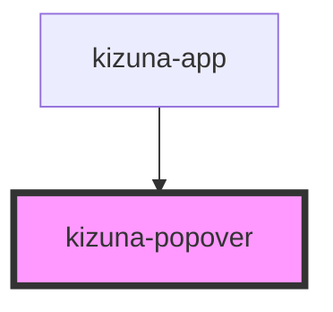

# kizuna-popover

<!-- Auto Generated Below -->

## Properties

| Property      | Attribute  | Description | Type                      | Default     |
| ------------- | ---------- | ----------- | ------------------------- | ----------- |
| `classes`     | --         |             | `{ [key: string]: any; }` | `undefined` |
| `darkmode`    | `darkmode` |             | `boolean`                 | `undefined` |
| `handleClose` | --         |             | `Function`                | `undefined` |
| `id`          | `id`       |             | `string`                  | `uuidv4()`  |
| `open`        | `open`     |             | `boolean`                 | `false`     |
| `position`    | `position` |             | `string`                  | `undefined` |

## Dependencies

### Used by

 - [kizuna-app](../App)

### Graph

----------------------------------------------

*Built with [StencilJS](https://stenciljs.com/)*
