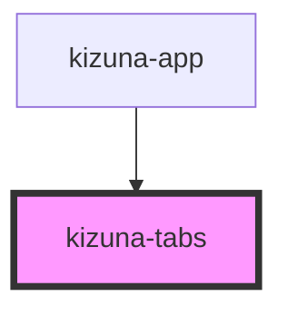

# kizuna-tabs

<!-- Auto Generated Below -->

## Properties

| Property   | Attribute  | Description | Type                           | Default     |
| ---------- | ---------- | ----------- | ------------------------------ | ----------- |
| `classes`  | --         |             | `{ [key: string]: string; }`   | `undefined` |
| `darkmode` | `darkmode` |             | `boolean`                      | `undefined` |
| `disabled` | `disabled` |             | `boolean`                      | `undefined` |
| `menus`    | --         |             | `{ [key: string]: string; }[]` | `undefined` |
| `name`     | `name`     |             | `string`                       | `undefined` |
| `onClick`  | `on-click` |             | `any`                          | `undefined` |
| `value`    | `value`    |             | `string`                       | `undefined` |

## Dependencies

### Used by

 - [kizuna-app](../App)

### Graph

----------------------------------------------

*Built with [StencilJS](https://stenciljs.com/)*
