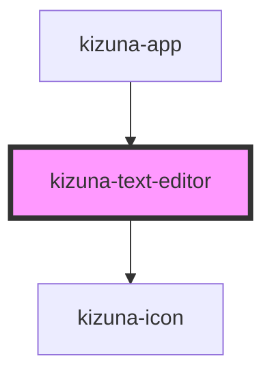

# kizuna-text-editor

<!-- Auto Generated Below -->

## Properties

| Property   | Attribute  | Description | Type       | Default     |
| ---------- | ---------- | ----------- | ---------- | ----------- |
| `darkmode` | `darkmode` |             | `boolean`  | `undefined` |
| `onChange` | --         |             | `Function` | `undefined` |
| `open`     | `open`     |             | `boolean`  | `false`     |
| `position` | `position` |             | `string`   | `undefined` |
| `selected` | `selected` |             | `string`   | `undefined` |

## Dependencies

### Used by

 - [kizuna-app](../App)

### Depends on

- [kizuna-icon](../kizuna-icon)

### Graph

----------------------------------------------

*Built with [StencilJS](https://stenciljs.com/)*
