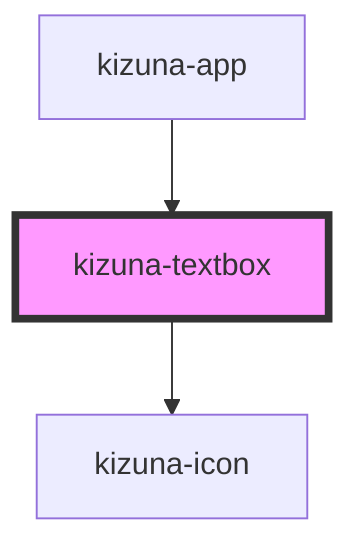

# kizuna-textbox

<!-- Auto Generated Below -->

## Properties

| Property          | Attribute         | Description | Type                      | Default     |
| ----------------- | ----------------- | ----------- | ------------------------- | ----------- |
| `align`           | `align`           |             | `string`                  | `undefined` |
| `classes`         | --                |             | `{ [key: string]: any; }` | `undefined` |
| `emoticon`        | `emoticon`        |             | `boolean`                 | `undefined` |
| `icon`            | `icon`            |             | `string`                  | `undefined` |
| `id`              | `id`              |             | `string`                  | `uuidv4()`  |
| `isFocus`         | `is-focus`        |             | `boolean`                 | `false`     |
| `label`           | `label`           |             | `string`                  | `undefined` |
| `name`            | `name`            |             | `string`                  | `undefined` |
| `onChange`        | --                |             | `Function`                | `undefined` |
| `onEmoticonClick` | --                |             | `Function`                | `undefined` |
| `placeholder`     | `placeholder`     |             | `string`                  | `undefined` |
| `startIconName`   | `start-icon-name` |             | `string`                  | `undefined` |
| `value`           | `value`           |             | `string`                  | `undefined` |
| `variant`         | `variant`         |             | `string`                  | `undefined` |

## Dependencies

### Used by

 - [kizuna-app](../App)

### Depends on

- [kizuna-icon](../kizuna-icon)

### Graph

----------------------------------------------

*Built with [StencilJS](https://stenciljs.com/)*
